# Boutique Online de Accesorios

## Autora
YARITZA CRUSTHEL MORA QUIJIJE

## Public IPv4 address
52.3.226.207

## Descripción del proyecto
Breve explicación del sitio web.  
Este proyecto consiste en el desarrollo de una boutique online de accesorios femeninos donde se muestran productos como collares, pulseras, anillos, aretes y sets de joyería.  
El sitio fue desarrollado utilizando tecnologías web modernas y diseño responsive para adaptarse a diferentes dispositivos.

## Tecnologías utilizadas
- HTML5  
- CSS3  
- Flexbox  
- CSS Grid  
- Responsive Design  

## Estructura del proyecto
Explicar brevemente la estructura de carpetas del sitio web.

```
html-site/
│── index.html          # Página principal
│── productos.html      # Catálogo de productos
│── contacto.html       # Información de contacto
│── registro.html       # Formulario de registro
│── README.md          # Documentación del proyecto
│
├── css/
│     ├── style.css    # Estilos principales
│     └── responsive.css # Estilos responsive
│
└── img/
      ├── banner.jpg   # Banner principal
      ├── logooo.avif # Logo de la boutique
      └── productos/   # Imágenes de productos
            ├── collar dorado
            ├── pulsera.webp
            ├── anillo.jpg
            ├── aretes.jpg
            ├── set.jpg
            └── collar de perlas.webp
```

## Publicación del sitio en AWS

Explicar de forma clara y ordenada el proceso de publicación del sitio web utilizando Amazon Web Services.

Tecnologías utilizadas en el servidor:

- Amazon Web Services (AWS)
- Instancias EC2
- Servidor LAMP (Linux, Apache, MySQL, PHP 8)

### Proceso de implementación

1. Creación de una instancia EC2 en Amazon Web Services.  

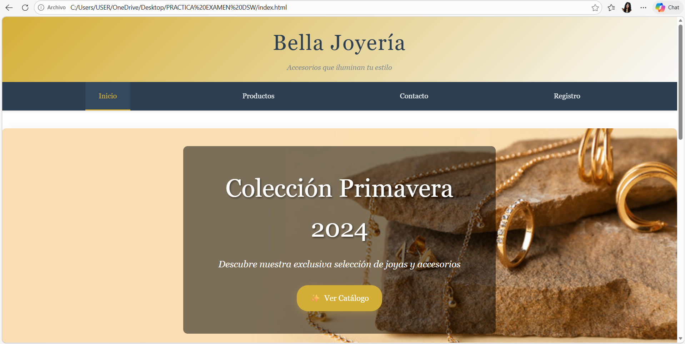

2. Configuración del servidor LAMP con PHP 8 dentro de la instancia.  

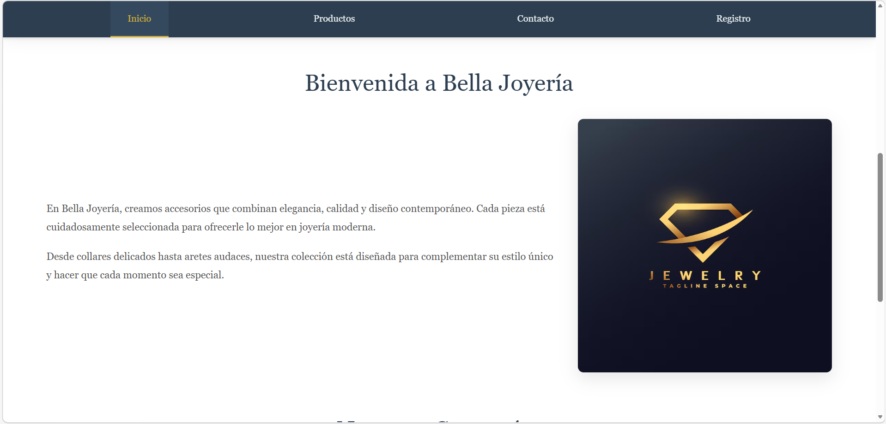

3. Creación del usuario y configuración de la contraseña del servidor.  

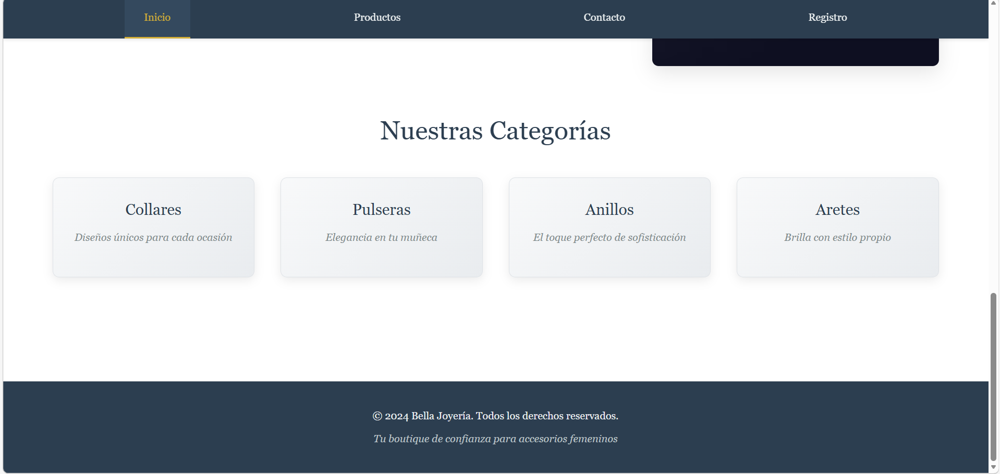

4. Conexión al servidor para administrar los archivos del sitio.  

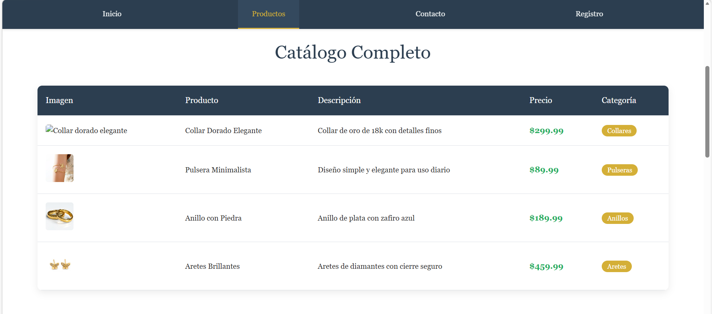

5. Uso de la herramienta WinSCP para transferir los archivos del proyecto al servidor.  

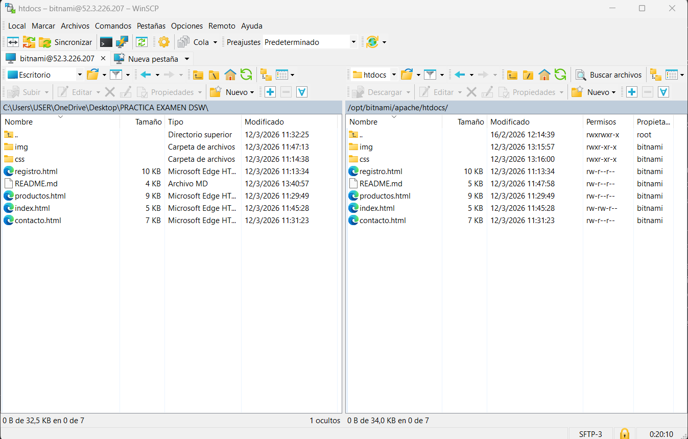

6. Copia de los archivos del sitio web a la carpeta del servidor web correspondiente.  

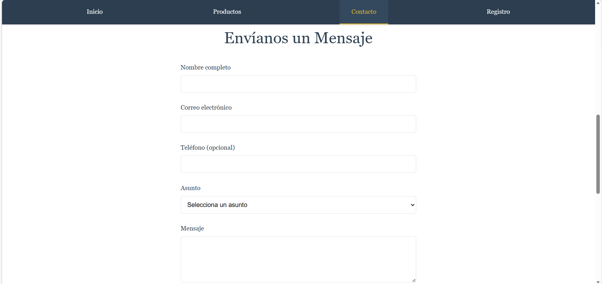

7. Verificación del funcionamiento del sitio web en el navegador utilizando la dirección IP pública de la instancia.  

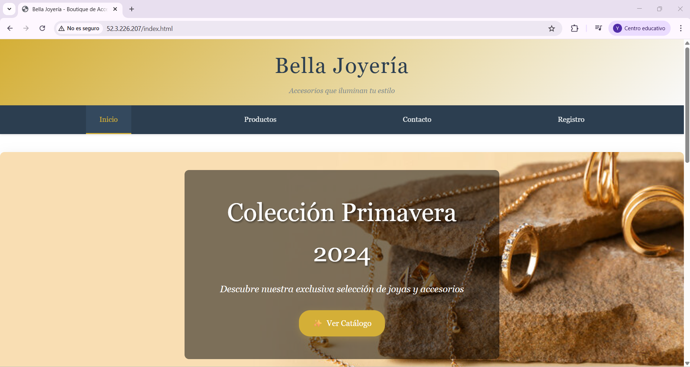
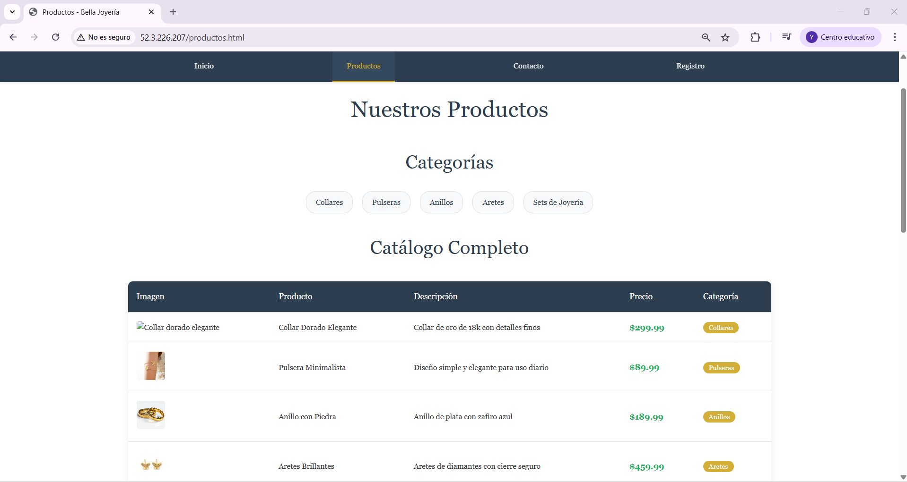
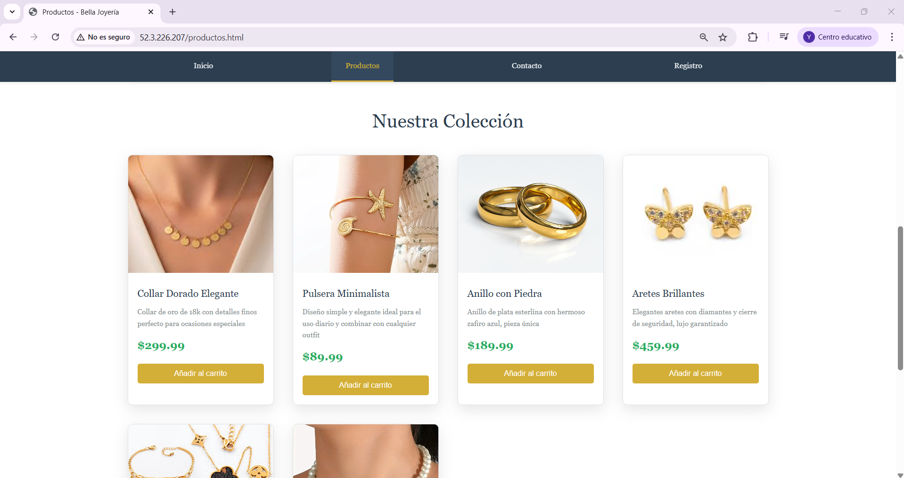
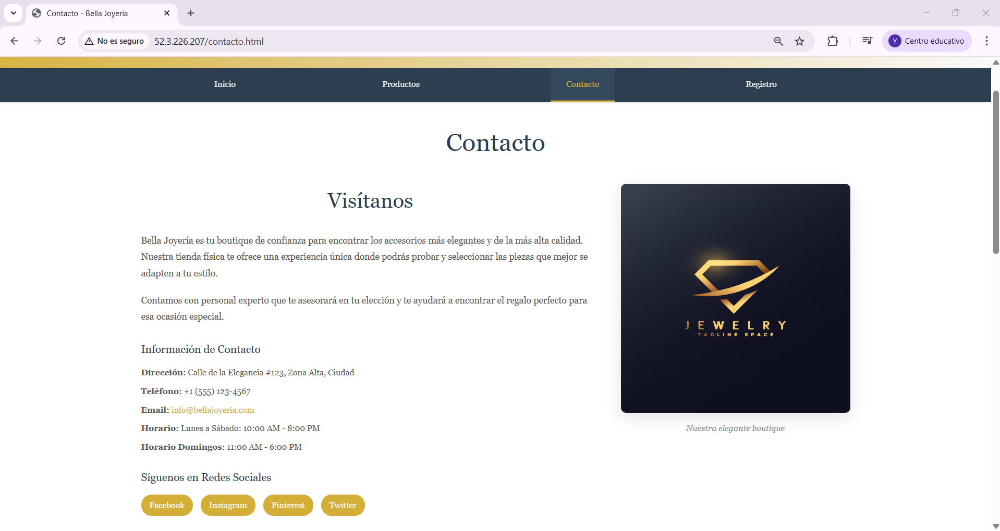
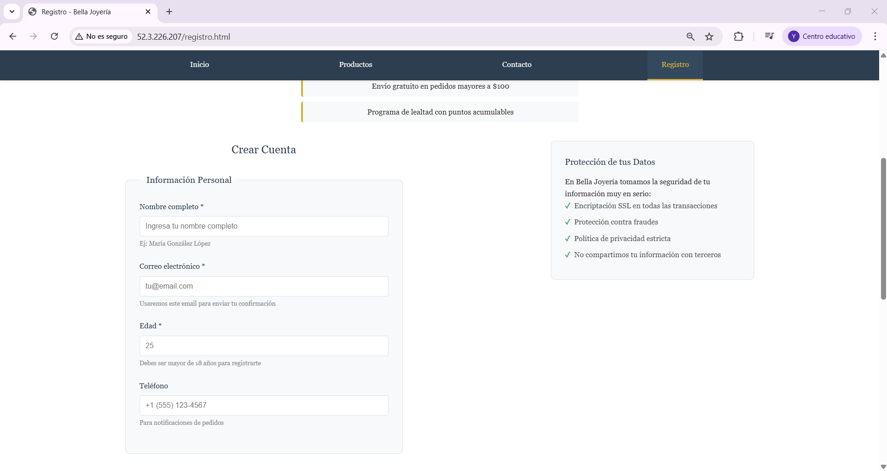
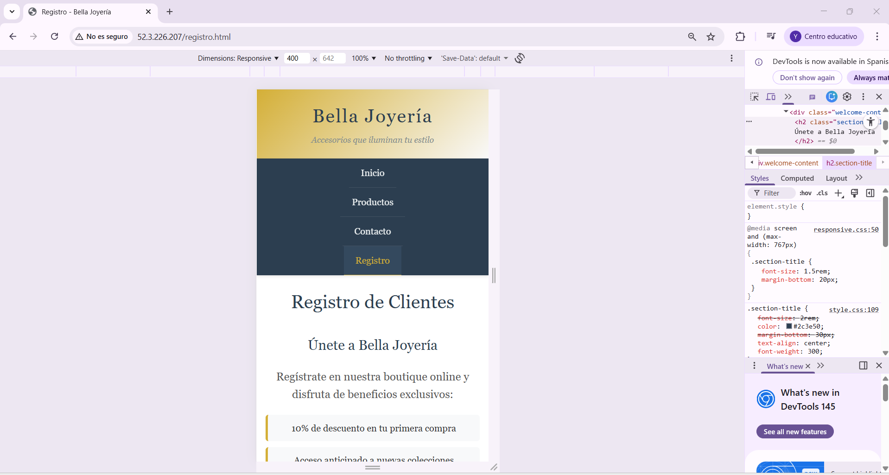
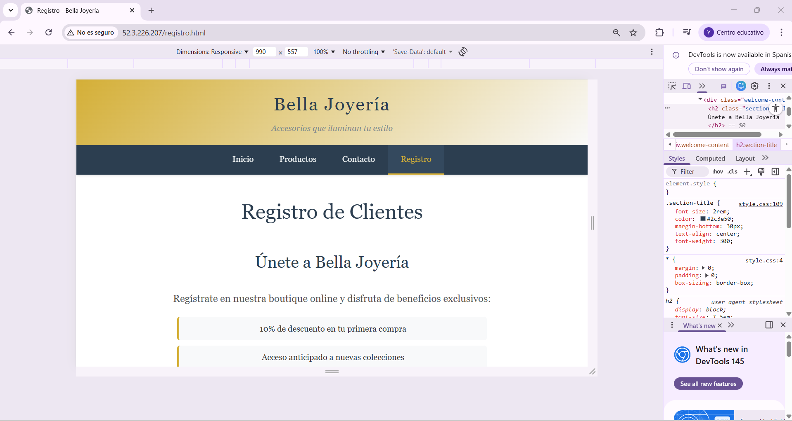

## Resultado
Explicar brevemente que el sitio web funciona correctamente y puede visualizarse desde el navegador mediante la IP pública del servidor.

El sitio web ha sido implementado exitosamente en el servidor AWS EC2 y funciona correctamente en todos los navegadores modernos. La boutique online de accesorios femeninos es accesible a través de la dirección IP pública del servidor, mostrando todas sus funcionalidades incluyendo el catálogo de productos, formulario de contacto, registro de clientes y diseño responsive en diferentes dispositivos. El sitio mantiene su elegante diseño y todas las características interactivas funcionan perfectamente en el entorno de producción.
